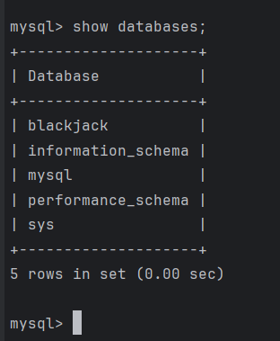
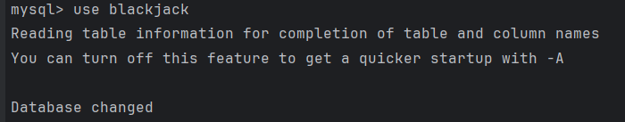
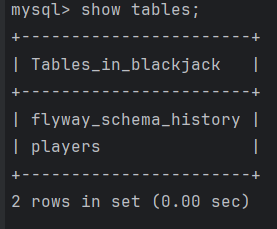
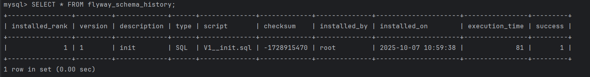

# 🎲 Blackjack Reactive API

A **Reactive Blackjack API** built with **Spring Boot 3 (WebFlux)**, **MongoDB**, and **MySQL R2DBC**, documented with **Swagger/OpenAPI**, and deployable with **Docker Compose**.

---

## 🚀 Features

- **Reactive REST API** using Spring WebFlux.
- **MongoDB** to store game sessions (deck, hands, game state).
- **MySQL with R2DBC** to store players, balances, and rankings.
- **Automatic migrations** with Flyway.
- **Interactive documentation** with Swagger UI.
- **Docker-ready** with Docker and Docker Compose.

---

## 🏗️ Architecture

### ASCII Diagram

```
                ┌────────────────────┐
                │   Swagger UI (API) │
                │   Browser/Player   │
                └─────────┬──────────┘
                          │
                          ▼
               ┌─────────────────────┐
               │   Spring Boot App   │
               │ (Blackjack API)     │
               │ - WebFlux           │
               │ - Services          │
               │ - Controllers       │
               └───────┬─────────────┘
      ┌────────────────┼───────────────────┐
      ▼                ▼                   ▼
┌───────────────┐ ┌───────────────┐ ┌────────────────┐
│   MongoDB     │ │    MySQL      │ │ Global Handler │
│   (Games)     │ │   (Players)   │ │   (ApiError)   │
│ - Deck        │ │ - Ranking     │ │ - 400 / 404 /  │
│ - Hands       │ │ - Balance     │ │   500 JSON     │
│ - State       │ │ - Stats       │ │                │
└───────────────┘ └───────────────┘ └────────────────┘
```

- **Controllers** → REST endpoints (`GameController`, `PlayerController`).
- **Services** → business logic (`GameService`, `PlayerService`, `BlackjackEngine`).
- **Domain** → Mongo (`Game`) and MySQL (`Player`) entities.
- **DTOs** → data transfer objects (`GameResponse`, `PlayRequest`, etc.).
- **Exception Handling** → `GlobalExceptionHandler` returns uniform error responses (`ApiError`).

---

## ⚙️ Requirements

- Java 21
- Maven 3.9+
- Docker & Docker Compose

---

## ▶️ Quickstart

1. Clone the repository:
   ```bash
   git clone https://github.com/your-username/blackjack-reactive-api.git
   cd blackjack-reactive-api
   ```

2. Build and run the containers:
   ```bash
   docker-compose up --build
   ```

3. Access the API:
    - Swagger UI: [http://localhost:8080/swagger-ui.html](http://localhost:8080/swagger-ui.html)
    - API Docs JSON: [http://localhost:8080/v3/api-docs](http://localhost:8080/v3/api-docs)

---

## 📖 Main Endpoints

### 🎮 Game (`/game`)
- `POST /game/new` → Start a new game.
- `GET /game/{id}` → Retrieve game state.
- `POST /game/{id}/play` → Make a move (`HIT`, `STAND`, `DOUBLE`).
- `DELETE /game/{id}/delete` → Delete a game.

### 👤 Player (`/player`)
- `PUT /player/{id}` → Rename a player.
- `GET /player/ranking` → Get Top 20 players by wins.

Game Flow (HIT, STAND, DOUBLE)

```text
              ┌─────────────────────┐
              │  Start New Game      │
              │  (2 cards each)      │
              └─────────┬───────────┘
                        │
                        ▼
              ┌─────────────────────┐
              │  Player's Turn       │
              └─────────┬───────────┘
      ┌─────────────────┼──────────────────┐
      ▼                 ▼                  ▼
┌─────────────┐   ┌──────────────┐   ┌──────────────────┐
│   HIT        │   │   STAND       │   │   DOUBLE BET     │
│ (draw card)  │   │ (end turn)    │   │ (double, 1 card) │
└───────┬─────┘   └─────┬────────┘   └─────────┬────────┘
        │               │                      │
        ▼               ▼                      ▼
 ┌─────────────┐   ┌──────────────┐     ┌──────────────┐
 │ Bust (>21)  │   │ Dealer's Turn │     │ Dealer's Turn │
 │ Dealer Wins │   │ (draws <17)   │     │ (draws <17)   │
 └───────┬─────┘   └─────┬────────┘     └─────────┬────┘
         │               │                        │
         ▼               ▼                        ▼
 ┌──────────────────────────────────────────────────────┐
 │                  Compare Totals                      │
 │  Player Blackjack → Pays 1.5x                        │
 │  Higher hand ≤ 21 → Player Wins                      │
 │  Lower hand or Bust → Dealer Wins                    │
 │  Equal totals → Push (tie)                           │
 └──────────────────────────────────────────────────────┘
```

---

## 🗄️ Database

- **MongoDB**: collection `games` (stores game sessions).
- **MySQL**: table `players` (stores players, stats, and balance).

Initial schema for `players`:

```sql
CREATE TABLE IF NOT EXISTS players (
  id BIGINT PRIMARY KEY AUTO_INCREMENT,
  name VARCHAR(100) NOT NULL UNIQUE,
  games_played INT NOT NULL DEFAULT 0,
  wins INT NOT NULL DEFAULT 0,
  losses INT NOT NULL DEFAULT 0,
  balance DECIMAL(12,2) NOT NULL DEFAULT 100.00,
  created_at TIMESTAMP DEFAULT CURRENT_TIMESTAMP
);
```

### 🔍 Verifying Flyway migrations

Follow these steps to confirm that **Flyway** correctly created your tables inside the MySQL Docker container.

1. **Find your MySQL container name**
   ```bash
   docker ps
   ```
   Look for the container running MySQL.

2. **Access the MySQL container**  
   Example if the container name is `s501_blackjackreactiveapi-mysql-1`:
   ```bash
   docker exec -it s501_blackjackreactiveapi-mysql-1 mysql -uroot -proot
   ```

3. **Inside the MySQL prompt (`mysql>`) run:**
   ```sql
   SHOW DATABASES;
   ```
   

   ```sql
   USE blackjack;
   ```
    
```sql
 SHOW TABLES;
   ```


   You should see:

`flyway_schema_history` → record of applied migrations

`players` → the table defined in `V1__init.sql`

   ```sql
   SELECT * FROM flyway_schema_history;
   ```

   Confirm that `V1__init.sql` migration was applied.

   ```sql
   DESCRIBE players;
   ```

   Check the expected columns: `id, name, games_played, wins, losses, balance, created_at`.

✅ If all of these checks pass, Flyway migrations are working and your database schema is ready.

---

## 🛡️ Error Handling

All errors are returned in a standard JSON format (`ApiError`):

```json
{
  "timestamp": "2025-10-13T14:35:00.000Z",
  "status": 404,
  "error": "Not Found",
  "message": "Game 123 not found",
  "path": "/game/123"
}
```

---

## 📊 Player Ranking

Example response:
```json
[
  {
    "id": 1,
    "name": "Alice",
    "gamesPlayed": 5,
    "wins": 3,
    "losses": 2,
    "balance": 108.5,
    "winRate": 60.0
  },
  {
    "id": 2,
    "name": "Bob",
    "gamesPlayed": 3,
    "wins": 1,
    "losses": 2,
    "balance": 97.0,
    "winRate": 33.3
  }
]
```

---

## 🐳 Docker Compose

Includes three services:
- `mysql` → Player database.
- `mongo` → Game database.
- `app` → Spring Boot backend.

---

## ✨ Author

- **Javier** – *Project Developer*  
  📧 doralozier@gmail.com

---
